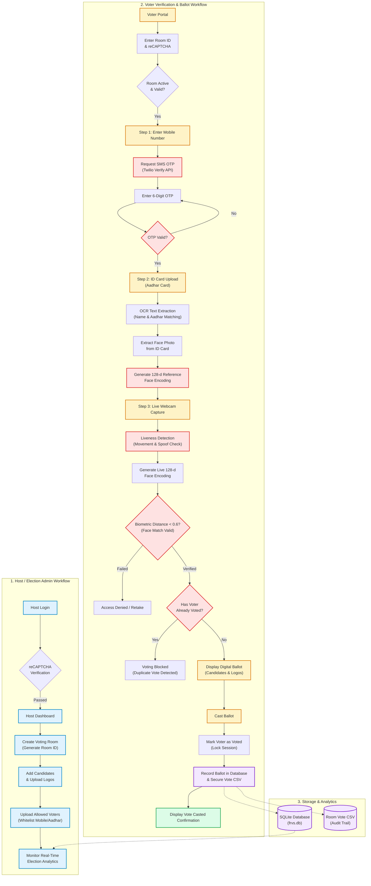

# Face Recognition Voting System (FRVS)

A secure, digital voting web application powered by Flask, OpenCV, face recognition, and SMS OTP authentication.

---

## Key Features

- **Facial Authentication**: Accurate facial verification using `face_recognition` and `dlib`.
- **Liveness & Spoof Prevention**: Motion and landmark detection to prevent screen/photo spoofing.
- **Two-Factor Authentication (2FA)**: SMS OTP verification using Twilio Verify API.
- **reCAPTCHA Protection**: Google reCAPTCHA v2 protection on login and verification endpoints.
- **Dynamic Voting Rooms**: Create custom election sessions with independent ballot candidates.
- **Real-Time Analytics**: Instant ballot tallying and election outcome charts.
- **Cloud-Ready**: Prepared for one-click deployment on [Render](https://render.com) (Native Python or Docker).

---

## System Workflow Diagram



---

## Project Architecture

```text
E-FRVS/
├── app.py                 # Core Flask application and API routes
├── database.py            # SQLite database models, connections, and migrations
├── wsgi.py                # WSGI application entrypoint for production
├── gunicorn_config.py     # Memory-optimized Gunicorn configuration for cloud
├── requirements.txt       # Python dependencies
├── render.yaml            # Render Blueprint deployment definition
├── build.sh               # Cloud build script (handles CMake parallelization)
├── Dockerfile             # Containerized deployment specification
├── .dockerignore          # Docker build exclusions
├── .gitignore             # Comprehensive secret and data protection
├── .env.example           # Sanitized environment variable template
├── templates/             # Jinja2 HTML templates
└── static/                # CSS, client JavaScript, and asset files
```

---

## Local Development Setup

### 1. Prerequisites
- Python 3.11 recommended (Python 3.9 - 3.11 supported)
- C++ build tools and CMake (required for compiling `dlib` if not using pre-built wheels)

### 2. Setup Virtual Environment
```bash
# Clone your repository
git clone https://github.com/<your-username>/<your-repo-name>.git
cd <your-repo-name>

# Create virtual environment
python -m venv .venv

# Activate virtual environment
# On Windows (PowerShell):
.\.venv\Scripts\Activate.ps1
# On Linux / macOS:
source .venv/bin/activate
```

### 3. Install Dependencies
```bash
python -m pip install --upgrade pip setuptools wheel
pip install cmake
pip install -r requirements.txt
```

### 4. Configure Environment Variables
Copy the example environment file:
```bash
cp .env.example .env
```
Open `.env` and fill in your values:
- `FLASK_SECRET_KEY`: A secure random string for session encryption.
- `RECAPTCHA_SITE_KEY` & `RECAPTCHA_SECRET_KEY`: From [Google reCAPTCHA Console](https://www.google.com/recaptcha/admin).
- `TWILIO_ACCOUNT_SID`, `TWILIO_AUTH_TOKEN`, `TWILIO_VERIFY_SERVICE_SID`: From [Twilio Console](https://console.twilio.com/).

### 5. Run the Application
```bash
python app.py
```
Open your browser at `http://127.0.0.1:5000`.

---

## Pushing to GitHub Safely

The `.gitignore` in this repository is configured to strictly exclude:
- Secrets & tokens (`.env`, `credentials.json`, `token.json`, `token_*.pickle`)
- Database files (`frvs.db`, `voting_system.db`, `*.sqlite*`)
- Voter vote records & image uploads (`votes/`, `uploads/`, `data/`, `logs/`)
- Heavy model files (`shape_predictor_*.dat`, `models/*.dat`, `*.bz2`)
- Local vendor trees (`dlib/`)

### To commit and push to GitHub:
```bash
git add .
git commit -m "Configure production-ready deployment for Render"
git branch -M main
git remote add origin https://github.com/<your-username>/<your-repo-name>.git
git push -u origin main
```

---

## Deploying to Render

You can deploy using either **Native Python (Render Blueprint)** or **Docker**.

### Method 1: Render Blueprint (Recommended)
1. Push this repository to GitHub.
2. Sign in to [Render](https://dashboard.render.com/).
3. Click **New +** → **Blueprint**.
4. Connect your GitHub repository.
5. Render will automatically detect [`render.yaml`](file:///c:/Users/avina/PROJECTS/E-FRVS/render.yaml) and configure the web service.
6. Under the service's **Environment** tab, fill in the secret values:
   - `RECAPTCHA_SITE_KEY`
   - `RECAPTCHA_SECRET_KEY`
   - `TWILIO_ACCOUNT_SID`
   - `TWILIO_AUTH_TOKEN`
   - `TWILIO_VERIFY_SERVICE_SID`
7. Click **Apply**. Render will run [`build.sh`](file:///c:/Users/avina/PROJECTS/E-FRVS/build.sh) and start the app via Gunicorn.

### Method 2: Manual Web Service Setup (Native Python)
1. In Render Dashboard, click **New +** → **Web Service**.
2. Connect your GitHub repository.
3. Choose **Python 3** for Runtime.
4. Set **Build Command**: `bash build.sh`
5. Set **Start Command**: `gunicorn --config gunicorn_config.py wsgi:app`
6. In **Environment Variables**, add:
   - `PYTHON_VERSION`: `3.11.0`
   - `CMAKE_BUILD_PARALLEL_LEVEL`: `1` (prevents compiler out-of-memory errors)
   - `PORT`: `10000`
   - `FLASK_SECRET_KEY`: Generate a random string
   - `RECAPTCHA_SITE_KEY`: Your reCAPTCHA site key
   - `RECAPTCHA_SECRET_KEY`: Your reCAPTCHA secret key
   - `TWILIO_ACCOUNT_SID`: Your Twilio Account SID
   - `TWILIO_AUTH_TOKEN`: Your Twilio Auth Token
   - `TWILIO_VERIFY_SERVICE_SID`: Your Twilio Verify Service SID
7. Click **Create Web Service**.

### Method 3: Containerized Deployment (Docker)
1. In Render Dashboard, click **New +** → **Web Service**.
2. Connect your GitHub repository.
3. Choose **Docker** as the Runtime.
4. Render will use [`Dockerfile`](file:///c:/Users/avina/PROJECTS/E-FRVS/Dockerfile) directly.
5. Add your Environment Variables in the **Environment** tab.
6. Click **Deploy**.

---

## Persistent Storage Note

On free cloud hosting tiers (like Render Free), the local filesystem is ephemeral and resets upon restarting or redeploying.
- To persist voter data across restarts in production on Render:
  1. Attach a **Render Persistent Disk** (e.g. mounted at `/var/data`).
  2. Add the environment variable:
     ```env
     DATABASE_PATH=/var/data/frvs.db
     ```
  The app will automatically read from and write to the mounted disk path.

---

## Security Best Practices
- Never commit `.env`, `credentials.json`, or `.db` files to source control.
- If any credentials were ever committed previously to git history, rotate them immediately in their respective provider consoles (Twilio, Google Cloud).
- Always use HTTPS in production.